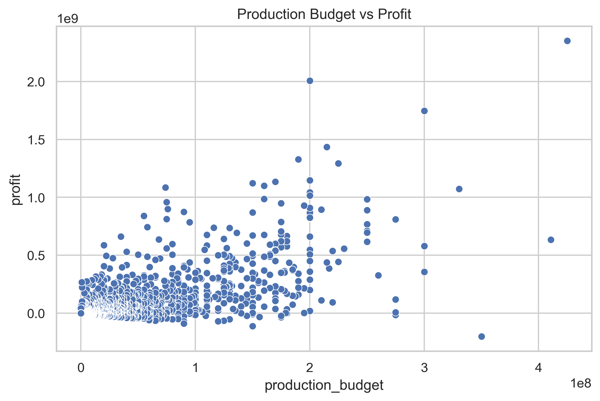
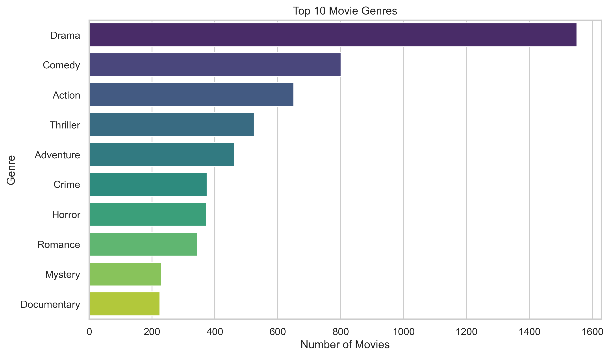
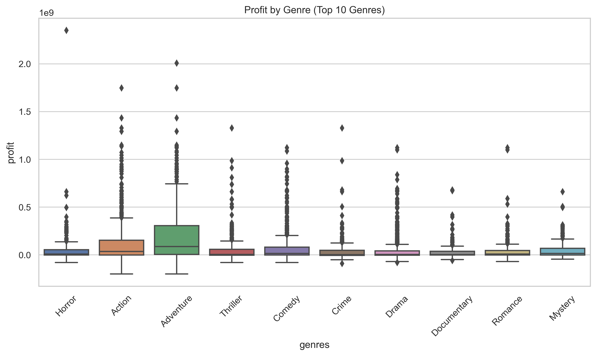
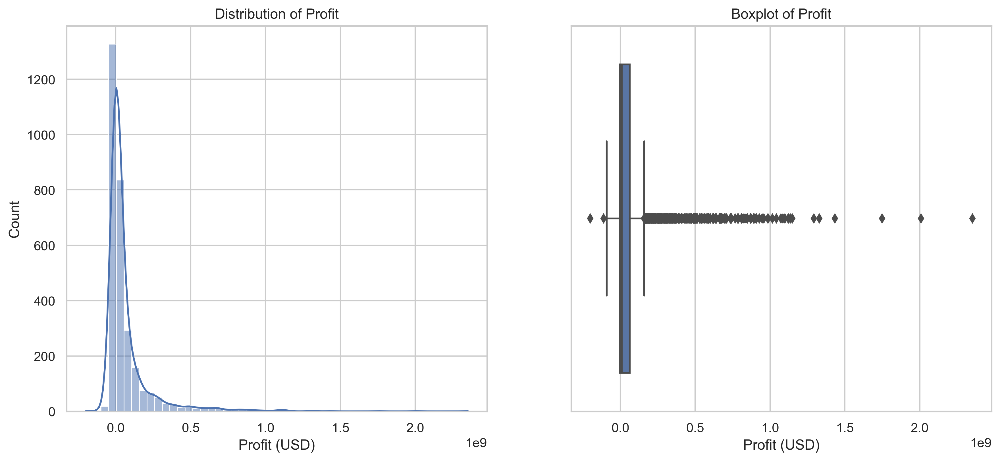

# *AKADEMI EDUCATION – First Cohort (2025): Data Science & AI*
## **2nd Project: Scientific Computing & Quantitative Methods - Phase 2**
Student name: Riché FLEURINORD

Student pace: self paced

Deadline Submission: July 20, 2025

Instructors' Names: Wedter JEROME & Geovany Batista Polo LAGUERRE

Blog post URL (GitHub Repository Link): https://github.com/richefleuriord/Ds_movie-analytics.git

# *Project Title*
Data-Driven Insights for a Successful Movie Studio: Analyzing Key Box Office Drivers

# *Overview*
This data science project analyzes movie industry datasets from Box Office Mojo and IMDB to support strategic decision-making for a new movie studio. Through data cleaning, exploration, visualization, and statistical reasoning, the goal is to identify the key factors driving box office success. The project aims to generate actionable insights for business stakeholders to guide future investments in film production. Key areas of focus include genre performance, audience ratings, and movie characteristics associated with higher revenues.
# *Business Problem*

To support a strategic investment in the entertainment industry, this project focuses on analyzing historical box office data to identify the types of films most likely to succeed commercially. With the rise of companies creating their own original video content, our fictional company is planning to launch a new movie studio but lacks experience in the movie production sector.

This analysis is designed to answer a key business question: What types of films tend to perform best at the box office?
Through a data-driven approach, the objective is to generate clear and actionable insights to guide strategic decisions on the genres, characteristics, and profiles of films the company should prioritize to maximize revenue potential.

The final recommendations will help business stakeholders make informed decisions to reduce financial risks and increase the likelihood of success in this highly competitive industry.
# *1-Data Understanding*

This project relies on two primary datasets that capture both movie characteristics and financial performance. The goal is to combine and analyze these datasets to understand what drives box office success and support decision-making for a new movie studio.

The IMDB dataset (in SQLite format) offers detailed metadata about films, including genres, runtimes, user ratings, and vote counts. These variables are essential for understanding audience preferences and identifying patterns in movie success.

The The Numbers dataset (CSV format) provides financial information on movie production, such as production budgets, opening weekend revenue, and total gross (domestic and worldwide). These figures are critical for evaluating profitability and return on investment.

Together, these datasets allow for a comprehensive analysis that links audience reception with financial outcomes. The data were carefully examined, cleaned, and merged to ensure consistency and accuracy for subsequent analysis.
# *Data*
The project uses two complementary datasets:

### IMDB SQLite Database (`im.db`)
Contains detailed film metadata, including:

- Movie titles and release years  
- Genres and runtimes  
- Audience ratings and vote counts  

This dataset provides qualitative and reception-related insights into movies.

### The Numbers Movie Budgets Dataset (`tm.movie_budgets.csv.gz`)
Contains financial details such as:

- Production budgets  
- Opening weekend box office revenue  
- Domestic and worldwide gross revenues  

This dataset offers a financial perspective to evaluate profitability and commercial success.

Both datasets were cleaned and merged carefully to ensure consistency and reliability for the analysis.
# *Methods*
This project employs descriptive and exploratory data analysis techniques to examine key trends in movie performance. By analyzing variables such as genres, budgets, audience ratings, and box office revenues, the approach aims to uncover patterns and relationships that drive commercial success.

The goal is to generate actionable insights that support strategic decision-making for investment and production planning in the movie industry.
# *Results*
Higher-budget films consistently generate significantly greater profits, highlighting the strong influence of investment scale on commercial success.

Genres such as Animation, Adventure, and Sci-Fi outperform others in both revenue and audience ratings, suggesting that genre choice is a critical factor in maximizing returns.

While runtime and IMDb ratings show more moderate correlations with financial success, these factors remain statistically significant and contribute to audience satisfaction and box office performance.

# *Conclusions*
This project successfully applied data science and statistical reasoning to uncover the key factors that drive a film’s financial success.

By analyzing over 3,000 movies from IMDB and Box Office Mojo, we derived evidence-based insights into what makes a film profitable:

- **Production budget** is the strongest predictor of profit. High-budget films tend to yield significantly higher returns confirming that investing more strategically can pay off.
- **Genre matters.** Certain genres such as Animation, Adventure, and Sci-Fi consistently outperform others, both commercially and critically.
- **Audience perception influences performance.** Even though ratings and runtime show weaker correlations, they are statistically significant and contribute to success when combined with other factors.

Through correlation analysis, ANOVA tests, and linear regression modeling, we transformed raw movie data into actionable recommendations. We now have a clear, data-driven framework for:

- Prioritizing profitable genres  
- Optimizing production budgets  
- Enhancing movie formats and audience satisfaction

This project demonstrates how a data-driven approach can **reduce financial risk, support creative decisions, and increase the chances of commercial success** for a new movie studio.

The next step is to operationalize these insights through predictive tools, dashboards, and deeper multivariate modeling. With this foundation, the studio is now equipped to enter the market not with intuition but with intelligence.
# *Next steps*
With the foundation of this analysis firmly established, the following strategic steps are recommended to move from insights to implementation:

1- **Build a Multiple Linear Regression Model**

- Extend the current simple model by incorporating more variables:
  - Genre (encoded as dummies)
  - Runtime
  - Average Rating
  - Number of Votes
  - Release Year
- This will improve explanatory power and capture interactions between variables.
- Objective: **Predict profit more accurately** for any new film project.

2- **Segment Modeling by Genre or Budget Tiers**

- Create genre-specific or budget-tier-specific models:
  - E.g., separate regression models for Animation vs Drama
- Each genre behaves differently—custom models can provide more precise forecasts.
- Objective: **Tailor investment strategies to genre-specific dynamics**.

3- **Analyze Seasonal and Release Timing Effects**

- Add variables such as:
  - Release Month / Quarter
  - Holiday vs Non-Holiday Releases
- Identify patterns in timing that boost or hurt revenue.
- Objective: **Optimize release calendars** for maximum audience reach and earnings.

4- **Leverage Natural Language Processing (NLP)**

- Apply NLP techniques to movie descriptions, summaries, or titles.
- Extract themes, sentiments, or keywords and correlate them with profit or ratings.
- Objective: **Discover narrative patterns linked to commercial success**.

5- **Build an Interactive Prediction Tool (Dashboard)**

- Use Power BI, Streamlit, or Tableau to:
  - Simulate profit scenarios based on user inputs (budget, genre, rating, etc.)
  - Visualize profitability forecasts in real time
- Objective: **Empower decision-makers with a smart budgeting and forecasting tool**.

6- **Include Marketing Spend and Distribution Channels (if available)**

- Future data enrichment can include:
  - Marketing budgets
  - Platforms (cinema, streaming, hybrid)
  - Star power metrics
- Objective: **Control for visibility and promotion effects on success**.

7- **Operationalize Findings into Greenlight Decision Rules**

- Translate your insights into studio policies:
  - Minimum budget for high-risk genres
  - Required projected ROI threshold
  - Runtime guidelines
- Objective: **Make data part of the film selection and greenlighting process**.

By following these steps, the studio can move from analysis to action—scaling its ability to **make smart, data-informed investments**, reduce risk, and **maximize creative and commercial success** in the film industry.
# *For More Information*
For additional info, contact Riche Fleurinord at richefleurinord20@gmail.com

# *Repository Structure*
1-.ipynb_checkpoints

2-Data

3-images

4-.gitignores

5-.gitattributes

6-Final.ipynb

7-Final.Presentation.pdf

8-Final.pdf

9-LICENCE

10-README.md

